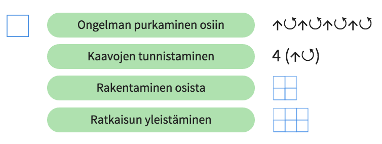
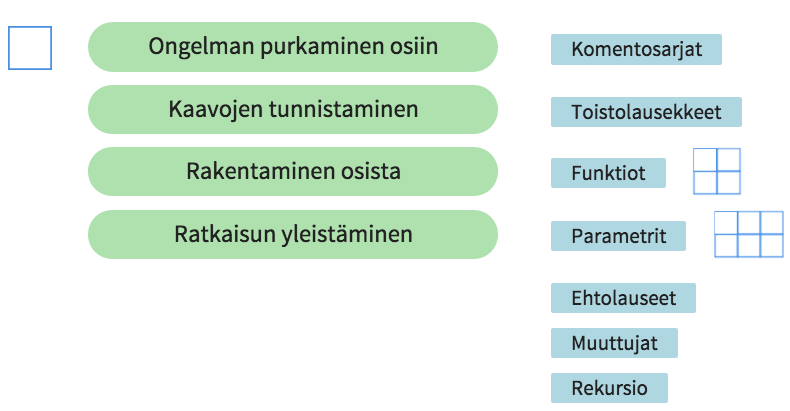
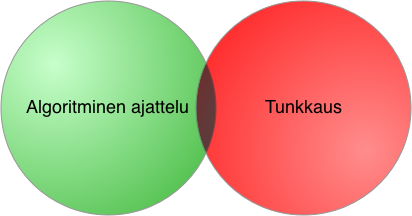

# Opettajien koodikoulu

Opettajien koodikoulussa tutustutaan ohjelmoinnin keskeisiin taitoihin ja välineisiin esimerkkien kautta. 

Aluksi harjoitellaan [Turtle Roy](https://turtle-roy.herokuapp.com/) -ympäristössä perusasioita. Turtle Royhin löytyy suomenkielinen [pikaohje](http://www.koodikirja.fi/turtle-roy/) Koodikirjan sivuilta.

Sen jälkeen
näytetään, kuinka koodaaja ajattelee, kun hän ratkaisee ongelmia. Esimerkkiongelmana on neliön piirtäminen, josta jatketaan ruudukon piirtämiseen. Lopuksi yleistetään ruudukon piirtämisen ratkaisu soveltumaan minkä tahansa kokoisille ruudukoille. Esimerkissä käytetyt algoritmisen ajattelun taidot kuvataan kaaviolla.

Ruudukon piirtämiseen tehty Turtle Roy -ohjelma löytyy [täältä](https://turtle-roy.herokuapp.com/?turtle=t4U4vIsp27).

Ajattelumallien lisäksi esitellään keskeiset ohjelmoinnin rakenteet.

Todetaan, että käytännössä ohjelmointi on puoliksi algoritmista ajattelua ja puoliksi "tunkkausta", eli säätämistä välineiden kanssa. Opettelussa kannattaa valita välineet siten, että tunkkaukseen menevä aika ei tapa motivaatiota. Toisaalta valintaan vaikuttaa myös se, kuinka paljon välineessä on opetuksellista syvyyttä ja miten hyvin se tukee luovuutta.

Tutustutaan ohjelmointiympäristöihin, kuten [Scratch](https://scratch.mit.edu/) ja [Koodaustunti](http://learn.code.org/hoc/1).

Eri opetusvälineiden sijoittuminen tunkkaus- ja ajatteluakselille.

Paljon lisää oppimismateriaaleja löytyy [Koodikoulusta](http://koodikoulu.fi) ja [Koodiaapisesta](http://koodiaapinen.fi). Myös [Koodikirjaan](http://koodikirja.fi) kannattaa tutustua.

### Koodiesimerkit

- [Laatoitus Turtle Roylla](https://turtle-roy.herokuapp.com/?turtle=A3dlRhBCOl)
- [Laatoitus Scratchilla](https://scratch.mit.edu/projects/140845793/#player)
- [Run-length -koodaus Turtle Roylla](https://turtle-roy.herokuapp.com/?turtle=7J10lcAJxh)

### Linkit

- Tämä dokumentti: http://tinyurl.com/opettajien-koodikoulu
- Turtle Roy -sivusto: http://turtle-roy.com
- Turtle Royn suomenkieliset ohjeet: http://www.koodikirja.fi/turtle-roy/
- Koodikirja: http://koodikirja.fi
- Koodiaapinen: http://koodiaapinen.fi
- Scratch: http://scratch.mit.edu
- Koodaustunti: http://learn.code.org/hoc/1
